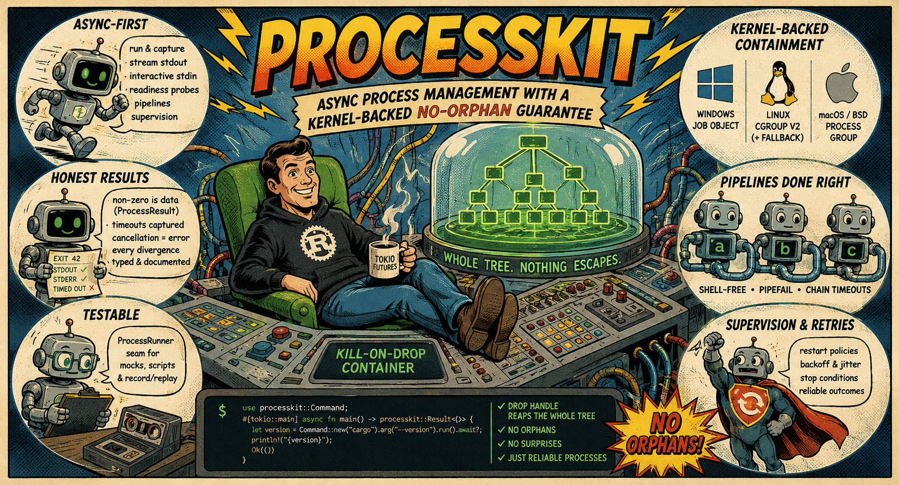

[](https://crates.io/crates/processkit)
[](https://docs.rs/processkit)
[](https://github.com/ZelAnton/ProcessKit-rs/actions/workflows/ci.yml)
[](https://coveralls.io/github/ZelAnton/ProcessKit-rs?branch=main)
[](https://github.com/ZelAnton/ProcessKit-rs/blob/main/LICENSE)
[](https://github.com/ZelAnton/ProcessKit-rs/blob/main/Cargo.toml)

Async child-process management for Rust + [tokio](https://tokio.rs/) with a
kernel-backed **no-orphan guarantee**: every process you start — and everything
*it* spawns — lives in a kill-on-drop container (a **Windows Job Object**, a
**Linux cgroup v2**, or a **POSIX process group**), so no descendant ever
outlives your program.

Beyond spawning a subprocess: run-and-capture, line streaming, interactive
stdin, real pseudo-terminal (PTY) sessions, shell-free pipelines, readiness
probes, timeouts & cancellation, supervision with restart/backoff, and a
mockable runner seam for subprocess-free tests.

```bash
cargo add processkit
```

```rust,no_run
use processkit::Command;

#[tokio::main]
async fn main() -> processkit::Result<()> {
    let version = Command::new("cargo").arg("--version").run().await?;
    println!("{version}");
    Ok(())
}
```

**Continue:** [find a recipe](cookbook.md) · [learn the command model](commands.md)
· [browse the API](https://docs.rs/processkit)

## Why processkit?

`std::process` and `tokio::process` reach (at most) the direct child. The
processes *it* spawned — a build tool's compiler children, the real payload
behind a wrapper (`cmd /c …`, `sh -c …`), a test's helper servers — can survive
a timeout, a panic, or a dropped future and keep running as orphans.

`processkit` puts every child inside the operating system's own containment
primitive. Teardown is one operation over the whole process tree, not a
best-effort signal to one PID:

- **Nothing escapes silently.** Dropping a run or group reaps every descendant;
  the active [`Mechanism`](https://docs.rs/processkit/latest/processkit/enum.Mechanism.html)
  tells you which OS guarantee is in effect.
- **Terminal when you need one.** The opt-in `pty` feature gives terminal-only
  tools a real controlling terminal while keeping the same containment and
  kill-on-drop lifecycle.
- **Honest outcomes.** A non-zero exit remains inspectable data until you ask
  for success; timeouts, cancellation, spawn failures, and resource limits stay
  distinct in the typed error model.
- **Async and testable.** Streaming, pipelines, readiness, and supervision are
  tokio-native, while the `ProcessRunner` seam replaces real processes with
  scripted or record/replay doubles in tests.

## 3.0 highlights

- **PTY support is here.** With the opt-in `pty` feature,
  `Command::use_pty()` gives terminal-only tools a real controlling terminal:
  `openpty` on Unix and `CreatePseudoConsole` (ConPTY) on Windows. The terminal
  has one merged output stream, supports interactive input plus initial/live
  window sizing, and stays inside the same kill-on-drop containment as a piped
  run. Start with the [PTY dialog](streaming.md#pty-dialog-wait-for-a-prompt-then-answer)
  and [window-size](streaming.md#pty-window-size-and-live-resize) sections, then
  check the [platform matrix](platform-support.md#pty-mode-use_pty-the-pty-feature).
- **Errors are split by responsibility.** `Error` is now a pointer-sized wrapper
  around `Box<ErrorReason>`; its existing accessors remain the convenient path,
  `reason()` exposes the structured variant, and `ErrorKind` is the coarse total
  classification for routing. See [Errors](errors.md) for the model and
  [Upgrading](upgrading.md#300-from-2x) for the 2.x migration.
- **Lifecycle streaming is end to end.** The renamed `events()` stream carries
  `ProcessEvent::Started` → ordered output → `ProcessEvent::Exited`, while
  `Pipeline::start()` and `Supervisor::start()` expose live sessions for
  observing and stopping multi-stage or restarted workloads. Continue with
  [lifecycle events](streaming.md#the-full-lifecycle-as-one-stream-events),
  [live pipelines](pipelines.md#streaming-a-live-chain), and
  [live supervision](supervision.md#live-sessions-start).
- **Tree shutdown and ownership are explicit.** `ProcessGroup::stop()` returns a
  `ShutdownReport`, `update_limits()` changes resource caps on a live group, and
  `spawn_detached()` is a separate opt-in for the exceptional child that must
  outlive its launcher. See [observable teardown](process-groups.md#observing-the-teardown-stop-and-shutdownreport),
  [live limits](process-groups.md#updating-a-live-group), and
  [detached children](process-groups.md#deliberately-detaching-a-child-spawn_detached).
- **Batch streaming and capture are production-ready.** Completion-order
  `output_stream` fan-out no longer holds fast results behind slow work;
  byte-accurate raw tees expose the undecoded stream; and `CapturePolicy`
  redacts or reshapes retained lines before they enter a result. See
  [results as they finish](batch.md#results-as-they-finish),
  [raw output](streaming.md#byte-accurate-raw-output-stdout_raw_tee), and
  [redaction at capture](streaming.md#redaction-at-capture-capture_policy).
- **The host is inspectable before and after launch.** `host_containment()`
  reports the effective containment mechanism without spawning;
  `process_info()` / `process_is_alive()` provide reuse-safe PID identity checks;
  and the new `metrics` feature publishes secret-safe counters and histograms.
  See [Platform support](platform-support.md#containment-mechanisms),
  [process identity](process-groups.md#identifying-a-process-by-pid-outside-a-group),
  and [Observability](observability.md#metrics).

The complete release record is in the
[`v3.0.0` release](https://github.com/ZelAnton/ProcessKit-rs/releases/tag/v3.0.0).

## Guides

**New to the crate?** Start with the [Cookbook](cookbook.md) — short
task-to-snippet recipes for everything the crate does — then read
[Running commands](commands.md) end to end (it's the vocabulary every other
guide builds on). Reach for the rest as the need arises, and keep
[Platform support](platform-support.md) handy before you ship: it collects
every per-OS caveat in one place.

| Guide | Covers |
|---|---|
| [Cookbook](cookbook.md) | "I want to …" → working snippet, for every capability; each recipe links to its deep guide |
| [Running commands](commands.md) | The `Command` builder end to end: args, env, stdin sources, encodings, buffer policies, line handlers, timeouts, retry, privileges — and every consuming verb (`run`, `output_string`, `probe`, …) with its error semantics |
| [Building typed CLI clients](cli-clients.md) | `CliClient` and `cli_client!`: wrapper structure, defaults and precedence, typed parsing/JSON, errors, scripted tests, and record/replay fixtures |
| [Running many at once](batch.md) | Bounded `output_all` / `output_all_bytes` fan-out, shared versus independent containment, and `wait_any` / `wait_all` races and joins |
| [Comparative benchmarks](comparison.md) | End-to-end processkit vs. plain Tokio and standard-library baselines across capture, streaming, and concurrent fan-out |
| [Process groups](process-groups.md) | Kill-on-drop containment: creating groups, spawning/adopting, teardown verbs, whole-tree signals, suspend/resume, member listing, resource limits, stats sampling |
| [Streaming & interactive I/O](streaming.md) | `start()` and the live `RunningProcess`: line streaming, interactive stdin, PTY dialogs/window resize/output hygiene, readiness probes (`wait_for_line` / `wait_for_port` / `wait_for`), racing children with `wait_any`, per-run profiling |
| [Pipelines](pipelines.md) | `a \| b \| c` without a shell (the `\|` operator works too): wiring, pipefail attribution, `unchecked_in_pipe()` stages for the `\| head` pattern, timeouts, stdin/stdout at the ends, re-running chains |
| [Timeouts, retries & cancellation](timeouts-and-cancellation.md) | How a deadline is *captured* vs when it errors, retry policies and their classifier, and cancellation: per-command tokens and the client-level `default_cancel_on` |
| [Errors](errors.md) | The `Error` wrapper, every `ErrorReason` variant, `ErrorKind`, subtle look-alikes (`Timeout` vs `Cancelled`, `NotReady` vs `Timeout`, `NotFound` vs `Spawn`, `CassetteMiss`), classifiers, and how retries/supervision use them |
| [Troubleshooting](troubleshooting.md) | Symptom-first diagnosis for surviving children, missing tools, unavailable limits, silent or ANSI-heavy output, stuck waits, Windows graceful stop, and readiness-vs-run deadlines |
| [Supervision](supervision.md) | Keeping a child alive: restart policies, backoff & jitter math, the failure-storm guard, stop conditions, outcomes, supervising inside a shared group |
| [Observability](observability.md) | The `tracing` event seam and the `metrics` counters/histograms over data the crate already computes — what's measured, the secret-hygiene guarantee (never argv/env), label cardinality, and wiring a backend exporter |
| [Testing your code](testing.md) | The `ProcessRunner` seam — bulk **and** streaming: `ScriptedRunner` (incl. scripted `start()` with canned, paced lines), `RecordingRunner`, `MockRunner`, record/replay cassettes, and building hermetically-testable CLI wrappers with `CliClient` |
| [Platform support](platform-support.md) | The containment mechanisms, every per-feature support matrix in one place, and the platform caveats worth knowing before you ship |
| [Running in containers](containers.md) | Docker/Kubernetes specifics: which mechanism you actually get, PID 1 signal/reaping behavior, graceful shutdown on the orchestrator's `SIGTERM`, minimal musl/Alpine images, and container limits vs. the crate's own `limits` |
| [Running untrusted children](untrusted-children.md) | A hardening checklist for launching a program you don't trust: containment, resource limits, privilege drop order, environment hygiene, output/wall-time bounds — what the crate guarantees, what it doesn't, and where to go for real isolation |
| [Upgrading](upgrading.md) | Per-version consumer upgrade notes, including the 2.x → 3.0 `ErrorReason` and lifecycle-event migrations |
| [What's next](whats-next.md) | Where the containment/runner approach is headed beyond this Rust crate |

## Feature flags

Every flag is **additive** and only gates *visibility* — the kill-on-drop tree
guarantee is unconditional in every configuration.

| Feature | Default | Adds | Extra dependency |
|---|---|---|---|
| `stats` | off | `ProcessGroup::stats` / `sample_stats`, `RunningProcess::cpu_time` / `peak_memory_bytes` / `profile` | `windows-sys/ProcessStatus` (Windows) |
| `process-control` | **on** | `Signal`, `ProcessGroup::{signal, suspend, resume, members, adopt}` | — |
| `limits` | off | Whole-tree resource caps on `ProcessGroupOptions` (`max_memory` / `max_processes` / `cpu_quota`), `ErrorReason::ResourceLimit`; implies `stats` | — |
| `mock` | off | A `mockall`-generated `MockRunner` for expectation-style tests (test-only; its `expect_*` surface is **semver-exempt**, tracking `mockall` — prefer `ScriptedRunner`/`RecordingRunner` for a stable double) | `mockall` |
| `tracing` | off | Events on the `processkit` target: spawn/exit, timeout & cancel firing, per-transition graceful teardown (`soft_signal` → `grace_started` → `drained`/`escalated`/`spared`), retries, supervisor storms, teardown anomalies (never argv/env) | `tracing` |
| `metrics` | off | Counters/histograms over already-computed run data: run/spawn counters, run-duration histograms, an exit-code/timeout/cancel tally, retry/restart/storm events — into any `metrics` recorder you install (never argv/env). See [Observability](observability.md) | `metrics` |
| `record` | off | `RecordReplayRunner` JSON cassettes over the runner seam | `serde`, `serde_json` |
| `json` | off | Typed whole-output JSON verbs (`Command::output_json`, …) and line-wise NDJSON streaming (`RunningProcess::stdout_json_lines`), with bounded, location-rich parse diagnostics | `serde`, `serde_json` |
| `report-serde` | off | `serde::Serialize` for the report types (`ProcessResult`, `RunProfile`, `ProcessGroupStats`, `ShutdownReport`, `MemberInfo`, `LimitEvidence`, supervision events/outcome/status), every enum tagged by its stable `name()` identifier. `Serialize` only, and never captured output/argv/env — see [Errors](errors.md#stable-machine-identifiers) | `serde` |
| `pty` | off | Real pseudo-terminal launch mode (`openpty` on Unix, ConPTY on Windows), interactive master input, merged output, initial/live window sizing | `windows-sys/Win32_System_Pipes` (Windows) |

```toml
[dependencies]
processkit = { version = "3", features = ["limits"] }
```

## The 60-second tour

```rust,no_run
use processkit::{Command, ProcessGroup, Stdin};

#[tokio::main]
async fn main() -> processkit::Result<()> {
    // One-shot: capture everything. A non-zero exit is data, not an Err.
    let head = Command::new("git").args(["rev-parse", "HEAD"]).output_string().await?;
    println!("HEAD = {}", head.stdout().trim());

    // Success-checking: non-zero exit / timeout / signal-kill become typed errors.
    let version = Command::new("cargo").arg("--version").run().await?;

    // Stdin, timeout, streaming, pipelines, supervision … see the guides.
    let sorted = Command::new("sort")
        .stdin(Stdin::from_string("b\na\n"))
        .timeout(std::time::Duration::from_secs(5))
        .run()
        .await?;

    // Containment: anything spawned through a group dies with it.
    let group = ProcessGroup::new()?;
    let _server = group.start(&Command::new("dev-server")).await?;
    drop(group); // the server — and everything *it* spawned — is reaped

    let _ = (version, sorted);
    Ok(())
}
```

## API reference

The rustdoc on [docs.rs](https://docs.rs/processkit) is the authoritative
per-item reference; these guides are the narrative layer on top — they explain
how the pieces compose, with the platform fine print collected in
[Platform support](platform-support.md).

**These examples are compiler-checked.** Every fenced Rust block across these
guides and the root `README.md` is compiled (and, unless annotated `no_run` or
`ignore`, actually run) as an ordinary doctest by `cargo test --all-features`
(as CI does) — a signature change that stops matching a guide's snippet fails
CI instead of silently lying to a reader. The hidden harness only builds under
`--all-features`, so a plain `cargo test` with the default features does
**not** exercise this check. See `src/doc_examples.rs` for the (test-only,
hidden) harness.
